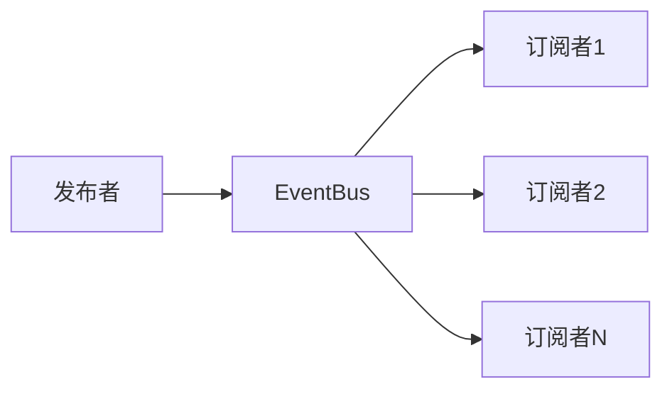

# Foundation - 设计模式

## 阅读路径

🟠🔵 **架构师+开发者**：README → patterns → architecture

## 模式清单

| 模式 | 模块 | 置信度 | 应用 |
|------|------|--------|------|
| Observer | event_bus | 高 | 发布订阅 |
| Factory | dotty, event_bus | 高 | 对象创建 |
| Singleton | EventBus | 高 | 全局实例 |
| Protocol | lifecycle | 高 | 接口定义 |

## 1. 观察者模式 (Observer)

**应用：** event_bus

**结构：**


**实现代码：**
```python
class EventBus:
    def subscribe(self, event_type, callback, priority=0):
        subscription = Subscription(priority, callback)
        self._subscriptions[event_type].add(subscription)

    def publish(self, event):
        for subscription in self._subscriptions[event.event_type]:
            subscription.callback(event)
```

## 2. 工厂模式 (Factory)

**应用：** dotty, get_event_bus

**实现代码：**
```python
def dotty(dictionary=None, no_list=False):
    """工厂函数：创建 Dotty 实例"""
    if dictionary is None:
        dictionary = {}
    return Dotty(dictionary, separator='.', esc_char='\\', no_list=no_list)

def get_event_bus() -> EventBus:
    """工厂函数：获取 EventBus 单例"""
    return EventBus()
```

## 3. 单例模式 (Singleton)

**应用：** EventBus

**实现代码：**
```python
from FQBase.Infrastructure.singleton import singleton

@singleton
class EventBus:
    pass
```

## 4. 协议模式 (Protocol)

**应用：** lifecycle

**实现代码：**
```python
from typing import Protocol, runtime_checkable

@runtime_checkable
class HealthCheckable(Protocol):
    def health_check(self) -> 'HealthStatus':
        ...
```

## 模式组合示例

```python
class PriceMonitor:
    def __init__(self, bus):
        self.bus = bus
        # 观察者模式：订阅事件
        self.bus.subscribe('price_update', self.on_price_update)

    def on_price_update(self, event):
        # 处理事件
        pass

# 使用工厂获取单例
bus = get_event_bus()
monitor = PriceMonitor(bus)
```

## 相关文档

- [架构](./architecture.md)
- [设计原则](./design.md)
