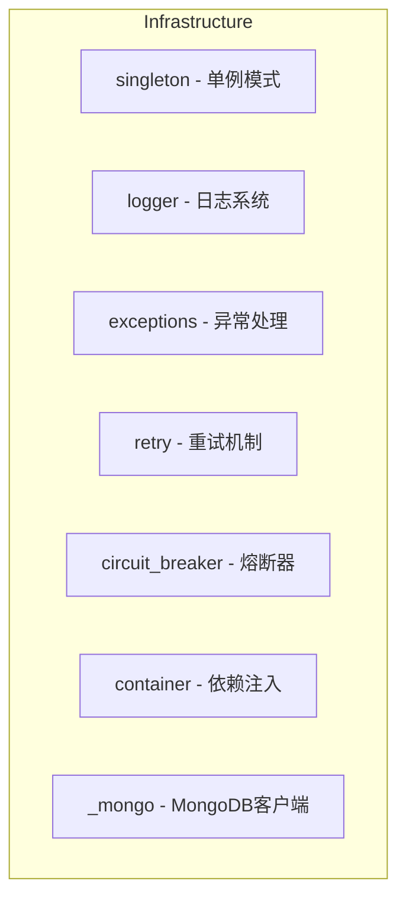

# Infrastructure

## 阅读路径

🔵 **开发者**：README → api → usage → concepts → examples

🟠 **架构师**：README → architecture → design → patterns

## 一句话总览

📌 **FQBase 底层基础设施模块，提供单例、日志、异常、重试、熔断器、依赖注入等核心能力。**

## 架构图

## 子模块

| 子模块 | 说明 |
|--------|------|
| singleton | 线程安全的单例模式实现 |
| logger | 统一日志系统 |
| exceptions | 异常类和异常处理工具 |
| retry | 重试装饰器 |
| circuit_breaker | 熔断器模式 |
| container | 依赖注入容器 |
| _mongo | MongoDB 客户端管理 |

## 快速链接

| 需求 | 文档 |
|------|------|
| 快速入门 | [快速入门](./quick-start.md) |
| 查看 API | [API参考](./api.md) |
| 核心概念 | [核心概念](./concepts.md) |
| 使用指南 | [使用指南](./usage.md) |
| 示例 | [示例](./examples.md) |
| 架构设计 | [架构](./architecture.md) |
| 设计原则 | [设计原则](./design.md) |
| 设计模式 | [设计模式](./patterns.md) |
| 配置指南 | [配置指南](./configuration.md) |
| 故障排查 | [故障排查](./troubleshooting.md) |
| 开发指南 | [开发指南](./development.md) |

## 文档统计

| 指标 | 值 |
|------|-----|
| 总文档数 | 16 |
| 核心类 | 40+ |
| 核心函数 | 10+ |
| 设计模式 | 5 |
| 异步支持 | 是 |
| 线程安全 | 是 |
| 被依赖关系 | Foundation, Config, Cache, DataStore, FQData |

## 相关文档

- [FQBase README](../README.md)
