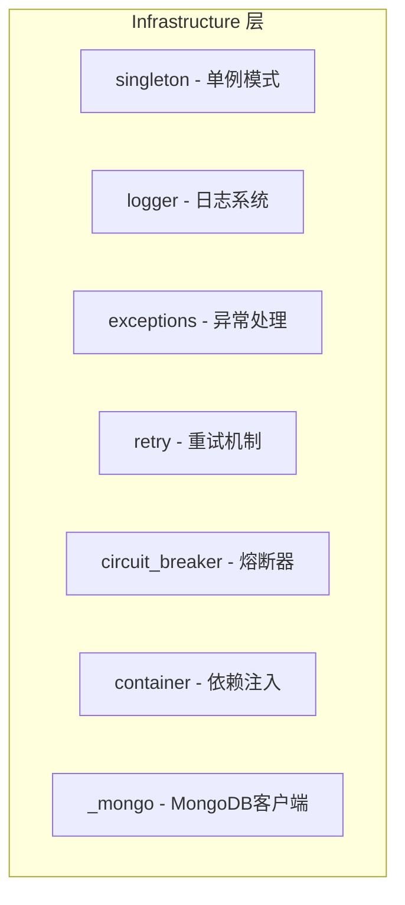

# Infrastructure - 架构

## 阅读路径

🟠🔵 **架构师+开发者**：README → architecture → design → patterns

## 架构全貌



## 核心组件

### singleton - 单例模式

**职责：** 提供线程安全的单例模式实现

**状态流转：**
```
无状态 --> 首次调用 --> 创建实例
                        │
                        ▼
               实例缓存于类变量
```

### logger - 日志系统

**职责：** 提供统一的日志记录接口

**关键数据流：**
```
应用代码 --> FQLogger --> logging模块 --> handlers --> 输出
```

### retry - 重试机制

**职责：** 为不稳定操作提供重试能力

**状态流转：**
```
调用 --> 成功? --> 返回结果
    │
    └─ 失败 → 达到最大次数? --> 抛出异常
              │
              └─ 未达最大次数 → 等待 --> 重新调用
```

### circuit_breaker - 熔断器

**职责：** 防止级联故障

**状态流转：**
```
CLOSED --> 连续失败达到阈值 --> OPEN
   ↑                              │
   │                         恢复超时
   │                              ↓
   │                        HALF_OPEN
   │                              │
   └───────── 连续成功 < 阈值 ------┘
```

### container - 依赖注入

**职责：** 管理服务依赖关系

**关键数据流：**
```
注册 --> ServiceDescriptor --> ServiceContainer.get() --> 实例化
                              │
                              └─> 解析依赖 --> 递归实例化
```

## 设计权衡

### 权衡1：单例 vs 依赖注入

单例模式简单但测试困难，依赖注入灵活但需要容器管理。

**决策：** 同时支持，通过 `@singleton` 装饰器和 `ServiceContainer` 两种方式。

### 权衡2：同步 vs 异步重试

同步重试简单，异步重试不阻塞但实现复杂。

**决策：** 默认同步重试，提供 `async_retry_with_exponential_backoff` 支持异步。

## 相关文档

- [设计原则](./design.md)
- [设计模式](./patterns.md)
