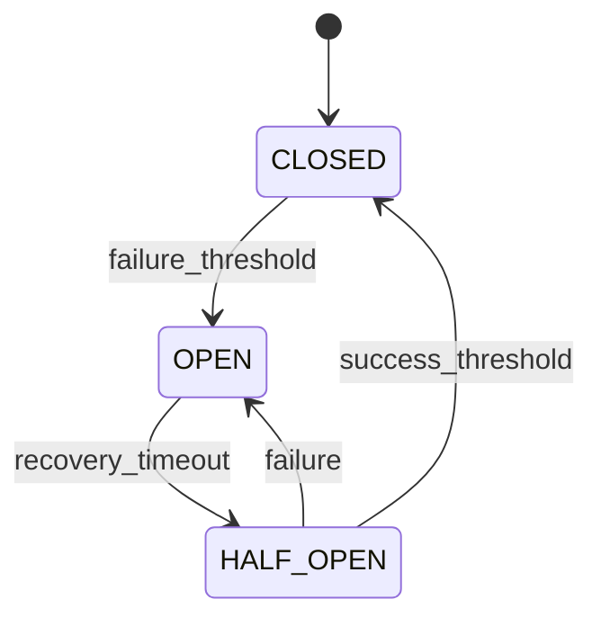

# Infrastructure - 设计模式

## 阅读路径

🟠🔵 **架构师+开发者**：README → patterns → architecture

## 模式清单

| 模式 | 模块 | 置信度 | 应用 |
|------|------|--------|------|
| Singleton | singleton | 高 | 全局唯一实例 |
| Decorator | retry | 高 | 重试逻辑 |
| Circuit Breaker | circuit_breaker | 高 | 故障隔离 |
| Dependency Injection | container | 高 | 依赖管理 |
| Factory | logger | 高 | logger 创建 |

## 1. 单例模式 (Singleton)

**应用：** singleton

**实现：**
```python
class SingletonMeta(type):
    def __new__(mcs, name, bases, namespace, **kwargs):
        cls = super().__new__(mcs, name, bases, namespace, **kwargs)
        cls._singleton_lock = threading.Lock()
        cls._singleton_instance = None
        return cls

    def __call__(cls, *args, **kwargs):
        if cls._singleton_instance is None:
            with cls._singleton_lock:
                if cls._singleton_instance is None:
                    cls._singleton_instance = super().__call__(*args, **kwargs)
        return cls._singleton_instance
```

## 2. 装饰器模式 (Decorator)

**应用：** retry

**实现：**
```python
def retry(stop_max_attempt_number=3, ...):
    def decorator(func):
        @wraps(func)
        def wrapper(*args, **kwargs):
            for attempt in range(stop_max_attempt_number):
                try:
                    return func(*args, **kwargs)
                except Exception as e:
                    if attempt == stop_max_attempt_number - 1:
                        raise
        return wrapper
    return decorator
```

## 3. 熔断器模式 (Circuit Breaker)

**应用：** circuit_breaker

**状态图：**


## 4. 依赖注入 (Dependency Injection)

**应用：** container

**实现：**
```python
class ServiceContainer:
    def register_singleton(self, service_type, implementation):
        self._descriptors[service_type] = ServiceDescriptor(
            service_type, implementation, ServiceLifetime.SINGLETON
        )

    def get(self, service_type):
        descriptor = self._descriptors[service_type]
        return descriptor.get_instance(self)
```

## 5. 工厂模式 (Factory)

**应用：** logger

**实现：**
```python
class FQLogger:
    _instances: Dict[str, 'FQLogger'] = {}

    @classmethod
    def get_instance(cls, name: str) -> 'FQLogger':
        if name not in cls._instances:
            cls._instances[name] = cls(name)
        return cls._instances[name]
```

## 相关文档

- [架构](./architecture.md)
- [设计原则](./design.md)
