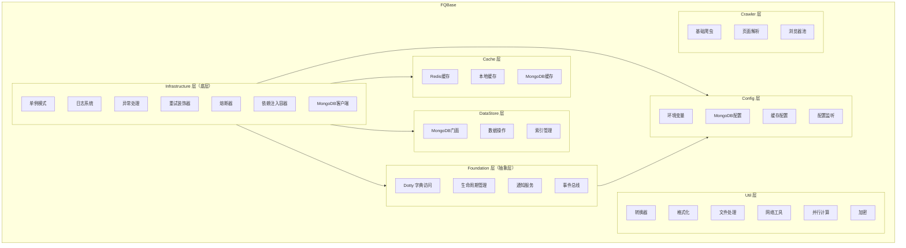

# FQBase

## 阅读路径

🟢 **新手入门**：README → quick-start → examples → concepts → glossary → usage

🔵 **开发者**：README → api → usage → concepts → examples

🟡 **运维/安全**：README → changelog → configuration → troubleshooting → best-practices

🟠 **架构师**：README → api → concepts → integrations → configuration → architecture → design → patterns → development

## 一句话总览

📌 **FQuant 基础框架包，提供配置管理、缓存、数据存储、事件总线、爬虫等基础设施，是 FQuant 项目的技术底座。**

## 子模块概览

| 子模块 | 级别 | 核心能力 | 文档链接 | 状态 |
|--------|------|---------|---------|------|
| Infrastructure | L3 | 单例、熔断器、重试、日志、依赖注入 | [README](./Infrastructure/README.md) | ✅ 已生成 |
| Foundation | L3 | 事件总线、通知、生命周期、Dotty | [README](./Foundation/README.md) | ✅ 已生成 |
| Config | L2 | 环境变量、MongoDB配置、路径配置 | [README](./Config/README.md) | ✅ 已生成 |
| Cache | L2 | Redis/Memory/MongoDB 多级缓存 | [README](./Cache/README.md) | ✅ 已生成 |
| DataStore | L2 | MongoDB CRUD、聚合、索引管理 | [README](./DataStore/README.md) | ✅ 已生成 |
| Util | L1 | 数据转换、文件处理、网络工具、并行计算 | [README](./Util/README.md) | ✅ 已生成 |
| Crawler | L1 | Selenium爬虫、页面解析 | [README](./Crawler/README.md) | ✅ 已生成 |

## 架构图



## ⚠️ AI 开发必读

### 使用场景

✅ **应该使用**：
- 需要统一日志、异常处理、重试机制时 → 使用 `Infrastructure`
- 需要事件驱动架构时 → 使用 `Foundation.EventBus`
- 需要发送通知（企业微信、Server酱）时 → 使用 `Foundation.Notification`
- 需要管理 MongoDB 连接和配置时 → 使用 `Config`
- 需要缓存功能时 → 使用 `Cache`
- 需要 MongoDB 数据操作时 → 使用 `DataStore`
- 需要爬取网页数据时 → 使用 `Crawler`
- 需要数据转换、文件处理等工具时 → 使用 `Util`

❌ **不应该使用**：
- 业务逻辑代码应放在 FQData/FQFactor 层，而非 FQBase
- FQBase 是基础设施层，不应包含业务领域逻辑

### 注意事项

1. **导入方式变更**
   - ❌ 错误做法：`from FQBase import singleton`
   - ✅ 正确做法：`from FQBase.Infrastructure import singleton`

2. **层级依赖关系**
   - Infrastructure 是最底层，不依赖任何 FQBase 模块
   - Foundation 依赖 Infrastructure
   - Config、Cache、DataStore、Util、Crawler 都依赖 Infrastructure

3. **单例模式使用**
   - 推荐使用 `@singleton` 装饰器而非手动实现

### 依赖

| 依赖类型 | 模块 | 说明 |
|---------|------|------|
| 必须 | pymongo | MongoDB 驱动 |
| 必须 | redis | Redis 驱动 |
| 可选 | selenium | 爬虫浏览器自动化 |
| 可选 | bs4 | 页面解析 |
| 可选 | celery | 异步任务队列 |

**TL;DR**：
- 解决什么问题：提供 FQuant 项目统一的基础设施（日志、缓存、数据库、事件、爬虫）
- 核心能力：Config管理、Cache缓存、DataStore存储、EventBus事件、Retry重试、CircuitBreaker熔断
- 入门难度：🔵 中等

**快速判断**：当您需要 日志/缓存/数据库/事件总线/爬虫/重试熔断 等基础设施时，使用 FQBase。

## 组合使用示例

### 示例1：Config + DataStore 协作

```python
from FQBase.Config import SETTING, get_database
from FQBase.DataStore import MongoDB, get_mongo_db

db = get_mongo_db(database="mydb")
db.insert_one("users", {"name": "test", "age": 25})
```

### 示例2：Infrastructure + Foundation 协作

```python
from FQBase.Infrastructure import singleton, get_logger
from FQBase.Infrastructure.retry import retry
from FQBase.Foundation import EventBus, Event

@retry(stop_max_attempt_number=3)
def fetch_data():
    logger = get_logger(__name__)
    event_bus = EventBus()
    event_bus.publish(Event("data_fetched", {"source": "api"}))
```

### 示例3：Cache + Util 协作

```python
from FQBase.Cache import redis_cache, create_cache
from FQBase.Util import dict_to_df

cache = create_cache()
cache.set("key", {"name": "test", "value": 100})
data = cache.get("key")
df = dict_to_df(data)
```

## 快速链接

| 需求 | 文档 |
|------|------|
| 了解核心概念 | [核心概念](./concepts.md) |
| 查看 API | [API参考](./api.md) |
| 快速入门 | [快速入门](./quick-start.md) |
| 故障排查 | [故障排查](./troubleshooting.md) |
| 配置指南 | [配置指南](./configuration.md) |
| 架构设计 | [技术架构](./architecture.md) |

## 相关文档

- [FQData 文档](../fqdata/README.md)
- [FQFactor 文档](../fqfactor/README.md)
