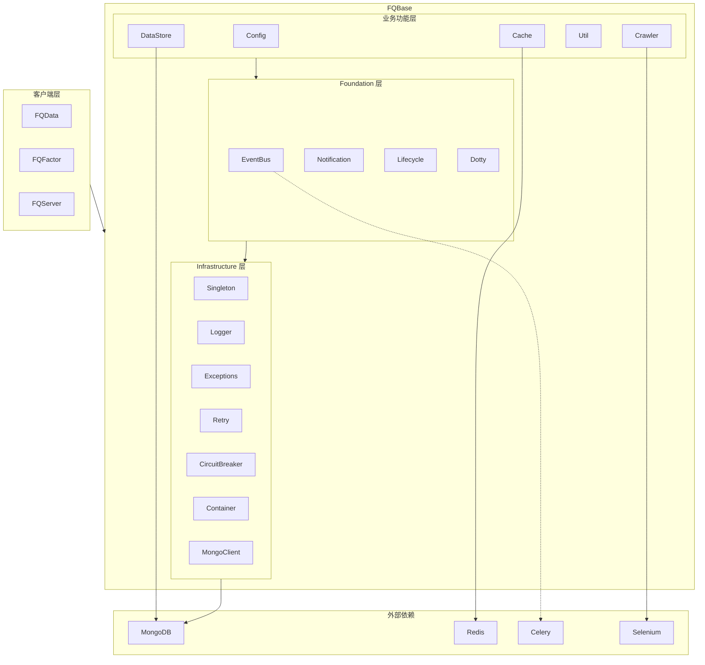
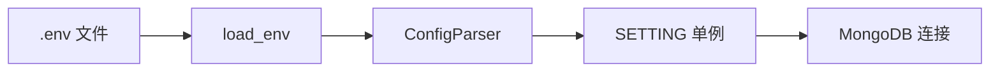
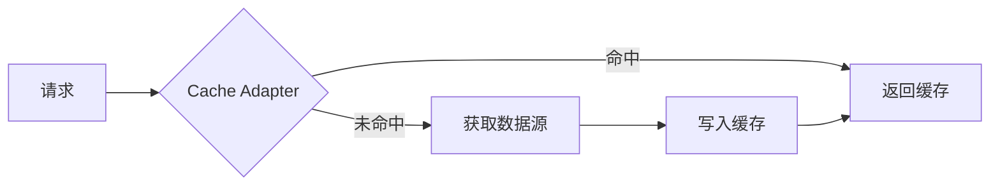
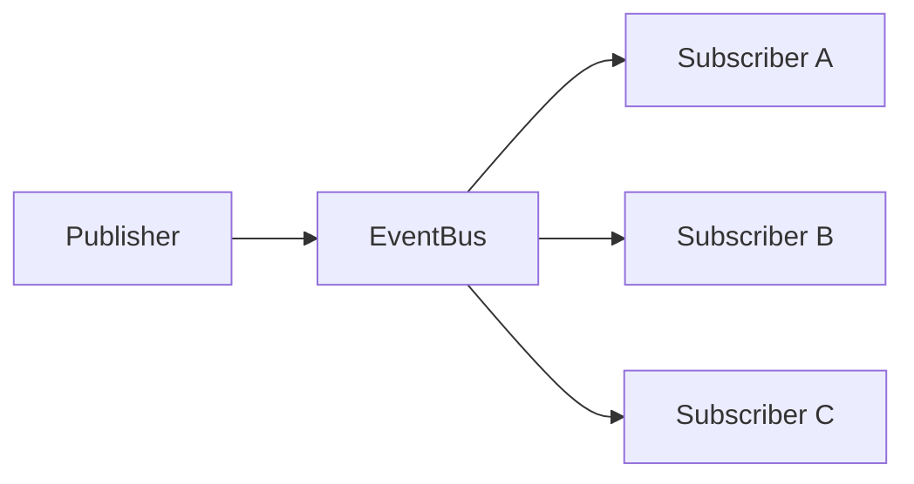

# FQBase - 技术架构

## 阅读路径

🟠🔵 **架构师+开发者**：README → architecture → design → patterns → development

## 概述

FQBase 采用分层架构，从底向上分为：Infrastructure（基础设施层）、Foundation（抽象层）、业务功能层（Config、Cache、DataStore、Util、Crawler）。

## 架构图



## 组件

### Infrastructure 层

**用途：** 提供底层技术基础设施

**职责：**
- 单例模式管理全局实例
- 统一日志系统
- 异常处理与传播
- 重试机制
- 熔断器保护
- 依赖注入容器
- MongoDB 客户端管理

### Foundation 层

**用途：** 提供业务层面的通用抽象

**职责：**
- 事件总线解耦组件通信
- 统一通知服务
- 生命周期管理
- Dotty 字典访问

### Config 层

**用途：** 管理配置

**职责：**
- 环境变量加载
- MongoDB 连接配置
- 缓存配置
- 配置监听与动态更新
- 路径管理

### Cache 层

**用途：** 多级缓存抽象

**职责：**
- 适配器模式封装多种后端
- 本地内存缓存
- Redis 分布式缓存
- MongoDB 持久化缓存

### DataStore 层

**用途：** MongoDB 数据存储

**职责：**
- 门面模式封装复杂操作
- CRUD 操作
- 聚合查询
- 索引管理
- 数据库运维

### Util 层

**用途：** 工具函数集

**职责：**
- 数据转换
- 文件处理
- 网络工具
- 并行计算
- 加密随机

### Crawler 层

**用途：** 爬虫基础设施

**职责：**
- Selenium 浏览器封装
- HTTP 请求封装
- 页面解析工具
- 浏览器池管理

## 关键数据流

### 数据流 1: 配置加载



**描述：** 应用启动时加载环境变量和配置文件，初始化配置单例。

**代码示例：**

```python
from FQBase.Config import load_env, SETTING

load_env()
client = SETTING.client
```

### 数据流 2: 缓存读写



**描述：** 缓存层拦截请求，命中则直接返回，未命中则查询数据源并写入缓存。

### 数据流 3: 事件驱动



**描述：** 发布者发布事件到总线，总线路由到所有订阅者。

## 依赖

| 依赖 | 版本 | 用途 |
|------|------|------|
| pymongo | >=4.0 | MongoDB 驱动 |
| redis | >=4.0 | Redis 驱动 |
| celery | >=5.0 | 异步任务队列（可选） |
| selenium | >=4.0 | 浏览器自动化（可选） |
| bs4 | >=4.0 | HTML 解析（可选） |

## 性能瓶颈点

| 阶段 | 潜在瓶颈 | 优化建议 |
|------|---------|---------|
| MongoDB 连接 | 连接池耗尽 | 合理配置 max_pool_size |
| Redis 缓存 | 网络延迟 | 使用本地缓存 + Redis 分层 |
| 事件总线 | 订阅者过多 | 异步处理 + 批量订阅 |
| 爬虫 | 浏览器资源 | 使用浏览器池复用 |

## 相关文档

- [设计原则](./design.md)
- [设计模式](./patterns.md)
- [API参考](./api.md)
