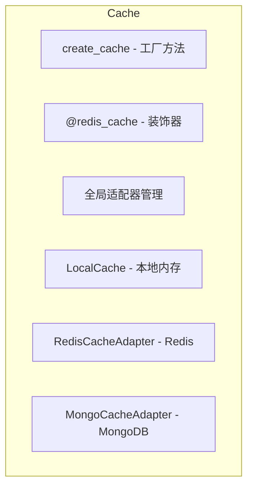

# Cache

## 阅读路径

🟢 **新手入门**：README → quick-start → examples → concepts → glossary → usage

🔵 **开发者**：README → api → usage → concepts → examples

🟡 **运维/安全**：README → changelog → configuration → troubleshooting → best-practices

## 一句话总览

📌 **FQBase 多级缓存层，支持 LocalMemory、Redis、MongoDB 三种缓存后端，提供统一的缓存接口和 @redis_cache 装饰器。**

## ⚠️ AI 开发必读

### 使用场景

✅ **应该使用**：
- 需要缓存函数结果 → 使用 `@redis_cache` 装饰器
- 需要多进程共享缓存 → 使用 Redis 缓存
- 需要持久化缓存 → 使用 MongoDB 缓存
- 开发环境快速测试 → 使用 LocalCache

❌ **不应该使用**：
- 对数据一致性要求极高的场景（缓存存在更新延迟）
- 敏感数据缓存（缓存无加密）

### 注意事项

1. **缓存降级**
   - Redis 连接失败时自动降级到 LocalCache
   - 使用 `init_cache_adapter()` 初始化时会自动选择可用后端

2. **键生成策略**
   - 装饰器使用 SHA256 哈希生成缓存键
   - 可通过 `key_prefix` 参数自定义键前缀

3. **TTL 设置**
   - 默认 TTL 300 秒
   - 可通过 `key_ttl_func` 动态设置 TTL

### 已知限制

- LocalCache 不支持跨进程共享
- MongoDB 缓存性能低于 Redis
- 缓存一致性问题需要业务层处理

### 依赖

| 依赖类型 | 模块 | 说明 |
|---------|------|------|
| 必须 | redis | Redis 客户端 |
| 可选 | pymongo | MongoDB 客户端 |
| 内置 | hashlib | 键生成 |

**TL;DR**：
- 解决什么问题：提供统一的缓存抽象，支持多种后端自动降级
- 核心能力：适配器模式、工厂方法、@redis_cache 装饰器
- 入门难度：🟢 简单

**快速判断**：当您需要 缓存函数结果/跨进程共享缓存/多级缓存 时，使用 Cache。

## 架构图

## 缓存后端对比

| 后端 | 适用场景 | 优点 | 缺点 |
|------|---------|------|------|
| LocalCache | 开发环境、单进程 | 零依赖、高性能 | 不支持分布式 |
| Redis | 生产环境、多进程 | 高性能、支持分布式 | 需要 Redis 服务 |
| MongoDB | 需要持久化 | 数据持久化 | 性能较低 |

## 快速链接

| 需求 | 文档 |
|------|------|
| 快速入门 | [快速入门](./quick-start.md) |
| 查看 API | [API参考](./api.md) |
| 配置指南 | [配置指南](./configuration.md) |
| 故障排查 | [故障排查](./troubleshooting.md) |

## 相关文档

- [FQBase README](../README.md)
