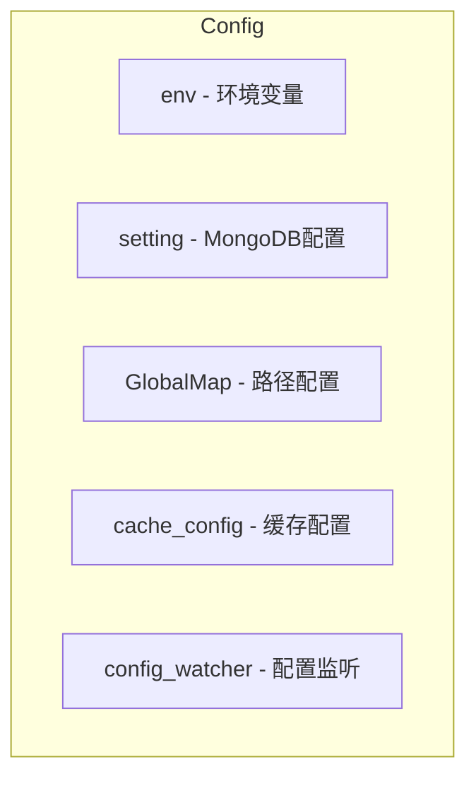

# Config

## 阅读路径

🟢 **新手入门**：README → quick-start → examples → concepts → glossary → usage

🔵 **开发者**：README → api → usage → concepts → examples

🟡 **运维/安全**：README → changelog → configuration → troubleshooting → best-practices

## 一句话总览

📌 **FQBase 配置管理模块，提供环境变量、MongoDB 配置、路径配置、缓存配置、配置监听等功能。**

## ⚠️ AI 开发必读

### 使用场景

✅ **应该使用**：
- 获取 MongoDB 连接 URI → 使用 `SETTING.get_mongo()`
- 获取应用路径配置 → 使用 `GLOBALMAP.FQDATA_PATH`
- 获取缓存配置 → 使用 `get_cache_config()`
- 监听配置变更 → 使用 `ConfigWatcher` 或 `watch_config()`
- 安全获取敏感配置 → 使用 `get_secure_env()`

❌ **不应该使用**：
- 在业务代码中硬编码配置值
- 直接读取 `.env` 文件

### 注意事项

1. **单例模式**
   - `SETTING` 和 `GLOBALMAP` 都是单例
   - 无需手动创建实例

2. **配置加载顺序**
   - 环境变量 → .env 文件 → config.ini → 默认值

3. **安全获取**
   - 使用 `get_secure_env()` 过滤占位符
   - 避免占位符泄露

### 依赖

| 依赖类型 | 模块 | 说明 |
|---------|------|------|
| 必须 | os | 环境变量读取 |
| 必须 | configparser | INI 文件解析 |
| 必须 | dotenv | .env 文件加载 |
| 可选 | pymongo | MongoDB 客户端 |

**TL;DR**：
- 解决什么问题：统一管理 FQuant 项目的所有配置
- 核心能力：环境变量、MongoDB 连接、路径配置、缓存配置、配置监听
- 入门难度：🟢 简单

**快速判断**：当您需要 获取配置/管理路径/监听配置变更 时，使用 Config。

## 架构图

## 子模块

| 子模块 | 说明 |
|--------|------|
| env | 环境变量加载和管理 |
| setting | MongoDB 连接配置和路径配置 |
| cache_config | 缓存配置管理 |
| config_watcher | 配置变更监听 |

## 快速链接

| 需求 | 文档 |
|------|------|
| 快速入门 | [快速入门](./quick-start.md) |
| 查看 API | [API参考](./api.md) |
| 配置指南 | [配置指南](./configuration.md) |
| 故障排查 | [故障排查](./troubleshooting.md) |

## 相关文档

- [FQBase README](../README.md)
