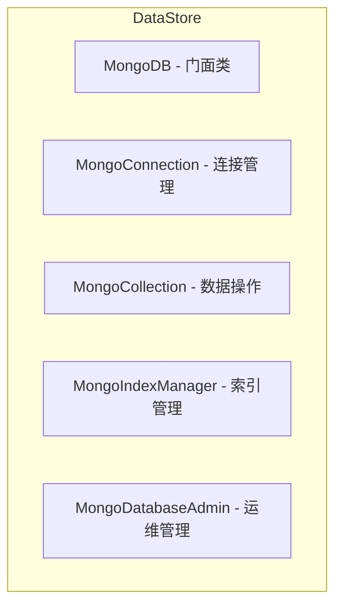

# DataStore

## 阅读路径

🟢 **新手入门**：README → quick-start → examples → concepts → glossary → usage

🔵 **开发者**：README → api → usage → concepts → examples

🟡 **运维/安全**：README → changelog → configuration → troubleshooting → best-practices

## 一句话总览

📌 **FQBase MongoDB 数据存储模块，提供门面模式封装的 CRUD、聚合、索引管理等操作。**

## ⚠️ AI 开发必读

### 使用场景

✅ **应该使用**：
- MongoDB 数据库操作 → 使用 `MongoDB` 门面类
- 需要聚合查询 → 使用 `MongoCollection.aggregate()`
- 需要索引管理 → 使用 `MongoIndexManager`
- 数据库运维操作 → 使用 `MongoDatabaseAdmin`

❌ **不应该使用**：
- 直接使用 pymongo（应通过 DataStore 门面）
- 在循环中进行单条插入（应使用批量操作）

### 注意事项

1. **门面模式**
   - `MongoDB` 是统一入口，封装了底层复杂性
   - 不要直接实例化 `MongoConnection` 等内部类

2. **连接管理**
   - 使用 `get_mongo_db()` 获取数据库实例
   - 避免频繁创建和关闭连接

3. **性能优化**
   - 批量操作优先于单条操作
   - 合理使用索引

### 依赖

| 依赖类型 | 模块 | 说明 |
|---------|------|------|
| 必须 | pymongo | MongoDB 驱动 |
| 必须 | FQBase.Infrastructure | 日志、异常 |

**TL;DR**：
- 解决什么问题：统一 MongoDB 数据存储操作
- 核心能力：CRUD、聚合、索引管理、运维
- 入门难度：🟢 简单

**快速判断**：当您需要 MongoDB 数据操作 时，使用 DataStore。

## 架构图

## 组件

| 组件 | 说明 |
|------|------|
| MongoDB | 门面类，统一入口 |
| MongoConnection | MongoDB 连接管理 |
| MongoCollection | CRUD 和聚合操作 |
| MongoIndexManager | 索引管理 |
| MongoDatabaseAdmin | 运维命令 |

## 快速链接

| 需求 | 文档 |
|------|------|
| 快速入门 | [快速入门](./quick-start.md) |
| 查看 API | [API参考](./api.md) |
| 配置指南 | [配置指南](./configuration.md) |
| 故障排查 | [故障排查](./troubleshooting.md) |

## 相关文档

- [FQBase README](../README.md)
