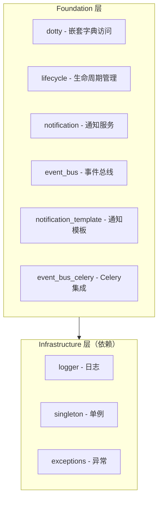

# Foundation - 架构

## 阅读路径

🟠🔵 **架构师+开发者**：README → architecture → design → patterns

## 架构全貌



## 核心组件

### dotty - 嵌套字典访问

**职责：** 提供对嵌套字典的点号访问能力

**关键数据流：**
```
dict --> Dotty包装 --> 点号访问 --> 原字典修改
```

### lifecycle - 生命周期管理

**职责：** 定义服务生命周期协议

**关键接口：**
- HealthCheckable: 健康检查
- Initializable: 初始化
- Shutdownable: 关闭

**状态流转：**
```
UNKNOWN --> INITIALIZING --> RUNNING --> DEGRADED --> STOPPING --> STOPPED
                                    └--> ERROR
```

### event_bus - 事件总线

**职责：** 实现组件间解耦通信

**关键数据流：**
```
发布者 --> EventBus.publish() --> 订阅者回调
                         │
                         └──> EventHistory（历史记录）
```

**线程模型：**
- 同步发布：主线程执行所有订阅者
- 异步发布：ThreadPoolExecutor 执行
- 优先级：priority 值越大越先执行

### notification - 通知服务

**职责：** 统一的通知发送接口

**关键数据流：**
```
NotificationManager --> WecomHandler --> 企业微信API
                  ├──> ServerChanHandler --> Server酱API
                  └──> PushBearHandler --> PushBear API
```

## 设计权衡

### 权衡1：单例 vs 依赖注入

EventBus 采用单例模式，简化了全局状态管理，但降低了测试性。

**决策：** 单例模式，因为事件总线本质上是全局通信总线。

### 权衡2：弱引用 vs 强引用

订阅者默认使用弱引用，防止内存泄漏，但可能导致订阅者被 GC。

**决策：** 默认弱引用，提供 `weak_ref=False` 选项。

## 相关文档

- [设计原则](./design.md)
- [设计模式](./patterns.md)
