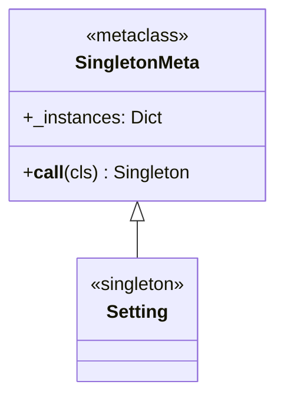
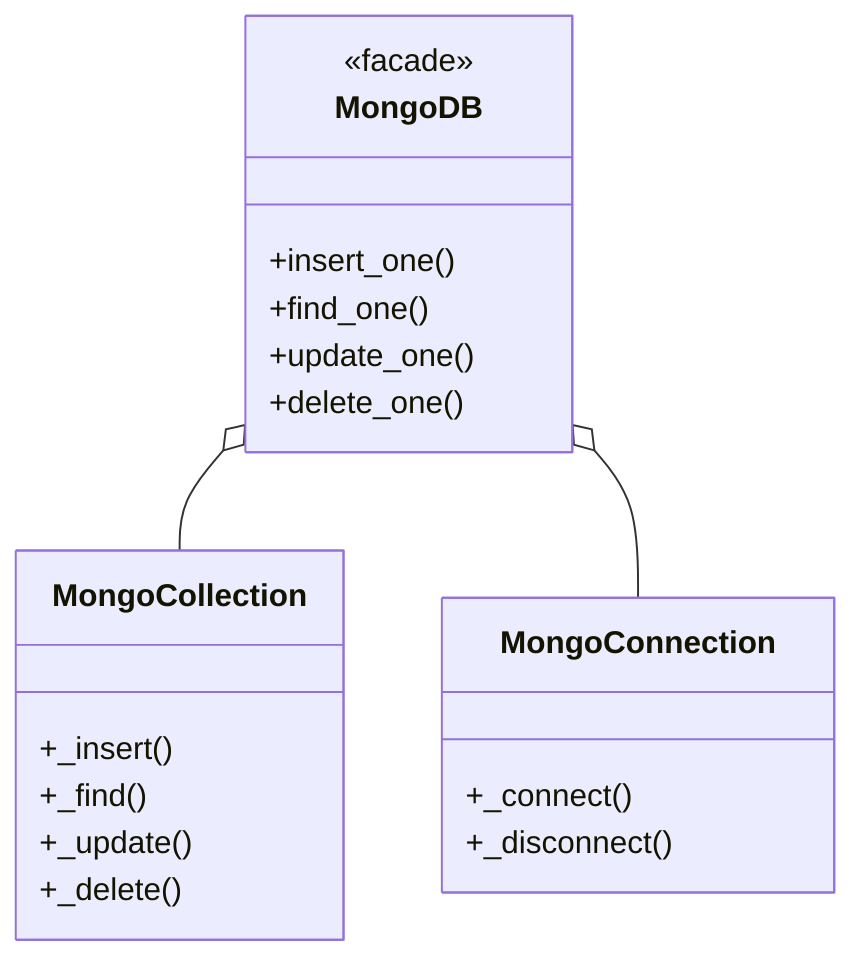
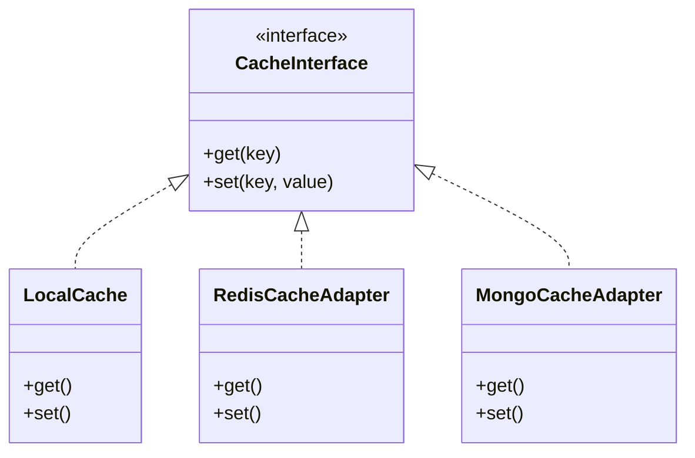
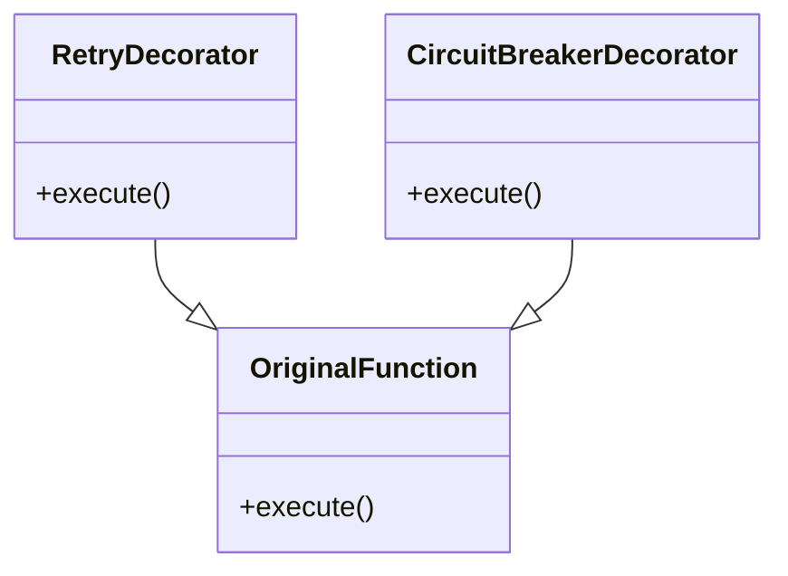
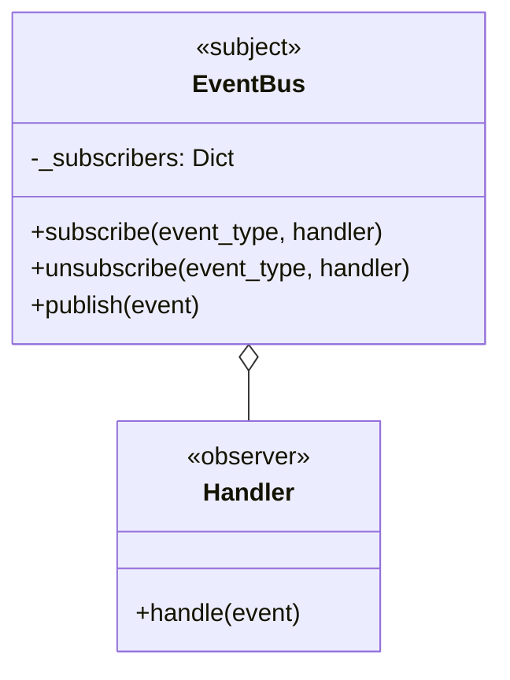
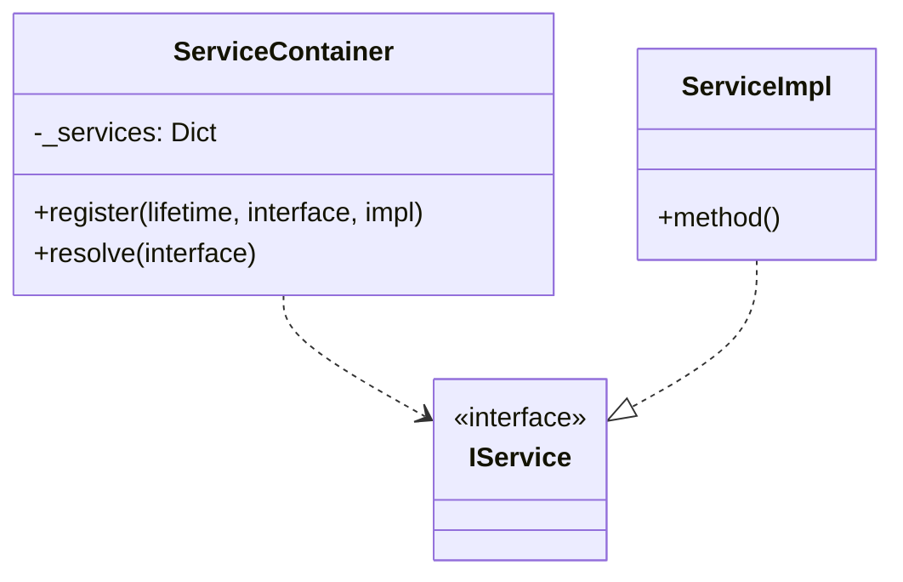

# FQBase - 设计模式

## 阅读路径

🟠🔵 **架构师+开发者**：README → patterns → architecture → design → development

## 概述

FQBase 使用了多种设计模式来实现基础设施功能。以下是主要模式的详细说明。

## 模式 1: 单例模式 (Singleton)

### 上下文

确保全局只有一个实例的场景，如数据库连接、缓存实例、配置单例。

### 模式结构



### 实现

```python
from FQBase.Infrastructure.singleton import singleton

@singleton
class Database:
    def __init__(self):
        self.client = MongoClient()

db1 = Database()
db2 = Database()
assert db1 is db2
```

### 适用场景

- 全局配置单例
- 数据库连接池
- 日志系统
- 缓存管理器

### 优缺点

**优点：**
- 全局唯一实例，节省资源
- 延迟初始化

**缺点：**
- 难以进行单元测试
- 隐式依赖关系

---

## 模式 2: 门面模式 (Facade)

### 上下文

简化复杂子系统接口的场景，如 MongoDB 的 CRUD 操作封装。

### 模式结构



### 实现

```python
class MongoDB:
    def __init__(self, uri=None):
        self._connection = MongoConnection(uri)
        self._collection = MongoCollection(self._connection)

    def find_one(self, collection, query):
        return self._collection.find(query)
```

### 适用场景

- 封装复杂依赖（如 pymongo）
- 提供统一接口
- 减少耦合

### 优缺点

**优点：**
- 简化客户端代码
- 降低耦合度

**缺点：**
- 可能隐藏复杂性

---

## 模式 3: 适配器模式 (Adapter)

### 上下文

统一不同缓存后端接口的场景，如 Redis、Memory、MongoDB 缓存。

### 模式结构



### 实现

```python
class CacheInterface(ABC):
    @abstractmethod
    def get(self, key: str): pass

    @abstractmethod
    def set(self, key: str, value: Any, ttl: int = 0): pass

class RedisCacheAdapter(CacheInterface):
    def __init__(self, config):
        self.client = redis.Redis(**config)

    def get(self, key: str):
        return self.client.get(key)

    def set(self, key: str, value: Any, ttl: int = 0):
        return self.client.setex(key, ttl, value) if ttl else self.client.set(key, value)
```

### 适用场景

- 多后端支持
- 接口统一
- 便于切换实现

### 优缺点

**优点：**
- 解耦调用方和实现
- 便于测试和扩展

**缺点：**
- 增加复杂度

---

## 模式 4: 装饰器模式 (Decorator)

### 上下文

动态添加重试、熔断等行为的场景。

### 模式结构



### 实现

```python
def retry(stop_max_attempt_number=3, wait_random_min=100, wait_random_max=500):
    def decorator(func):
        @wraps(func)
        def wrapper(*args, **kwargs):
            for attempt in range(stop_max_attempt_number):
                try:
                    return func(*args, **kwargs)
                except Exception as e:
                    if attempt == stop_max_attempt_number - 1:
                        raise
                    time.sleep(random.randint(wait_random_min, wait_random_max) / 1000)
        return wrapper
    return decorator

@retry(stop_max_attempt_number=3)
def fetch_data():
    return requests.get(url)
```

### 适用场景

- 日志记录
- 性能监控
- 重试机制
- 熔断保护

### 优缺点

**优点：**
- 动态扩展功能
- 避免继承滥用

**缺点：**
- 调试困难

---

## 模式 5: 观察者模式 (Observer)

### 上下文

事件驱动架构，组件间松耦合通信。

### 模式结构



### 实现

```python
class EventBus:
    def __init__(self):
        self._subscribers: Dict[str, List[Callable]] = defaultdict(list)

    def subscribe(self, event_type: str, handler: Callable):
        self._subscribers[event_type].append(handler)

    def publish(self, event: Event):
        for handler in self._subscribers[event.type]:
            handler(event)
```

### 适用场景

- 事件驱动架构
- 解耦组件通信
- 异步任务触发

### 优缺点

**优点：**
- 松耦合
- 易于扩展

**缺点：**
- 事件顺序不确定
- 调试困难

---

## 模式 6: 依赖注入 (Dependency Injection)

### 上下文

管理依赖关系，提高可测试性。

### 模式结构



### 实现

```python
class ServiceContainer:
    def __init__(self):
        self._services = {}

    def register(self, lifetime: ServiceLifetime, interface, implementation):
        self._services[interface] = ServiceDescriptor(lifetime, implementation)

    def resolve(self, interface):
        desc = self._services.get(interface)
        if desc.lifetime == ServiceLifetime.singleton:
            if not hasattr(self, '_instances'):
                self._instances = {}
            if interface not in self._instances:
                self._instances[interface] = desc.implementation()
            return self._instances[interface]
        return desc.implementation()
```

### 适用场景

- 单元测试
- 依赖管理
- 生命周期控制

### 优缺点

**优点：**
- 显式依赖
- 易于测试
- 生命周期管理

**缺点：**
- 增加复杂度

---

## 模式间协作

| 模式组合 | 协作方式 | 示例场景 |
|----------|---------|---------|
| 单例 + 门面 | 单例提供门面实例 | Database 单例封装 MongoDB 操作 |
| 适配器 + 工厂 | 工厂创建适配器 | Cache.create_cache() 创建各种缓存适配器 |
| 装饰器 + 观察者 | 事件触发装饰逻辑 | EventBus 触发 @retry 装饰的方法 |
| 依赖注入 + 门面 | 容器解析门面 | Container.resolve(MongoDB) |

## 相关文档

- [技术架构](./architecture.md)
- [设计原则](./design.md)
